# Multiplayer Lobby Library

A Go library for building multiplayer lobby systems with session management, real-time communication, and automatic reconnection support. This library is designed to be transport-agnostic and easily integrated into games and real-time applications.

**⚠️ Early Development**: This library is still in early development. The API may change between versions.

**📖 Demo Application**: See [lobby-demo](https://github.com/jonOsm/lobby-demo) for a complete working example with React frontend and Go backend.

## Quick Start

```go
package main

import (
    "fmt"
    "log"
    "net/http"
    "github.com/gorilla/websocket"
    lobby "github.com/jonosm/multiplayer-lobby"
)

func main() {
    // Create managers
    sessionManager := lobby.NewSessionManager()
    manager := lobby.NewLobbyManagerWithEvents(&lobby.LobbyEvents{
        Broadcaster: func(userID string, message interface{}) {
            // Send message to user's connection
        },
    })
    
    // Set up handler dependencies
    deps := &lobby.HandlerDeps{
        SessionManager: sessionManager,
        LobbyManager:   manager,
        ConnToUserID:   make(map[interface{}]string),
    }
    
    // Create message router with default handlers
    router := lobby.NewMessageRouter()
    router.SetupDefaultHandlersWithCustom(deps, &lobby.HandlerOptions{
        GameStartConfig: lobby.DefaultGameStartConfig,
        ResponseBuilder: lobby.NewResponseBuilder(manager),
    })
    
    // WebSocket endpoint
    http.HandleFunc("/ws", func(w http.ResponseWriter, r *http.Request) {
        conn, err := upgrader.Upgrade(w, r, nil)
        if err != nil {
            return
        }
        
        for {
            _, msg, err := conn.ReadMessage()
            if err != nil {
                break
            }
            router.Dispatch(conn, msg)
        }
    })
    
    log.Fatal(http.ListenAndServe(":8080", nil))
}
```

## User Flow

The typical user journey through the lobby system:


## Core Components

The library consists of three main components that work together to provide a complete lobby system:

```mermaid
graph TB
    SM[SessionManager<br/>• User sessions<br/>• Reconnection<br/>• Token auth]
    LM[LobbyManager<br/>• Lobby state<br/>• Player mgmt<br/>• Game start]
    MR[MessageRouter<br/>• Route messages<br/>• Handle actions<br/>• Send responses]
    HD[HandlerDeps<br/>• SessionManager<br/>• LobbyManager<br/>• ConnToUserID mapping]
    
    SM --> HD
    LM --> HD
    MR --> HD
    
    style SM fill:#e1f5fe,color:#0d47a1
    style LM fill:#f3e5f5,color:#4a148c
    style MR fill:#e8f5e8,color:#1b5e20
    style HD fill:#fff3e0,color:#e65100
```



### SessionManager

Manages user sessions and handles reconnection logic.

```go
// Create session manager
sessionManager := lobby.NewSessionManager()

// Create new user session
session := sessionManager.CreateSession("alice")
// session.ID = "abc123"
// session.Token = "secure_token_here"

// Validate session token (for authentication)
if session, valid := sessionManager.ValidateSessionToken("alice", "token"); valid {
    // User is authenticated
}

// Handle reconnection with stored token
if session, reconnected := sessionManager.ReconnectSession("alice", "token"); reconnected {
    // User successfully reconnected
}

// Track lobby membership for auto-reconnection
sessionManager.SetLobbyID(session.ID, "lobby123")

// Clean up stale sessions
sessionManager.CleanupStaleSessions(10 * time.Minute)
```

### LobbyManager

Manages lobbies and player interactions.

```go
// Create lobby manager with event handlers
manager := lobby.NewLobbyManagerWithEvents(&lobby.LobbyEvents{
    OnPlayerJoin: func(lobby *lobby.Lobby, player *lobby.Player) {
        fmt.Printf("%s joined %s\n", player.Username, lobby.Name)
    },
    OnLobbyFull: func(lobby *lobby.Lobby) {
        fmt.Printf("Lobby %s is full!\n", lobby.Name)
    },
    Broadcaster: func(userID string, message interface{}) {
        // Send message to specific user
    },
})

// Create a lobby
lobby, err := manager.CreateLobby("Game Room", 4, true, nil, "owner123")

// Add player to lobby
player := &lobby.Player{ID: "player123", Username: "alice"}
err = manager.JoinLobby(lobby.ID, player)

// Set player ready status
err = manager.SetPlayerReady(lobby.ID, "player123", true)

// Start the game
err = manager.StartGame(lobby.ID, "owner123")
```

### MessageRouter

Handles incoming messages and routes them to appropriate handlers.

```go
// Create router with default handlers
router := lobby.NewMessageRouter()
router.SetupDefaultHandlersWithCustom(deps, &lobby.HandlerOptions{
    // Use default game start validation
    GameStartConfig: lobby.DefaultGameStartConfig,
    
    // Or use custom validation
    GameStartValidator: func(l *lobby.Lobby, username string) error {
        // Custom validation logic
        return nil
    },
    
    // Custom response builder
    ResponseBuilder: lobby.NewResponseBuilder(manager),
})

// Dispatch incoming messages
err := router.Dispatch(conn, messageBytes)
```

## API Reference

### Core Types

#### Lobby
```go
type Lobby struct {
    ID         LobbyID                // Unique identifier
    Name       string                 // Human-readable name
    MaxPlayers int                    // Maximum players allowed
    CreatedAt  time.Time              // Creation timestamp
    Public     bool                   // Public or private
    Players    []*Player              // List of players
    State      LobbyState             // Current state (waiting, in_game, finished)
    Metadata   map[string]interface{} // Custom data
    OwnerID    string                 // Lobby owner
}
```

#### Player
```go
type Player struct {
    ID       PlayerID               // Unique identifier
    Username string                 // Display name
    Ready    bool                   // Ready status
    Metadata map[string]interface{} // Custom data
}
```

#### UserSession
```go
type UserSession struct {
    ID       string    // Unique identifier
    Username string    // Username
    Token    string    // Secure session token
    Active   bool      // Connection status
    LobbyID  string    // Current lobby (for reconnection)
    LastSeen time.Time // Last activity timestamp
}
```

### SessionManager Methods

```go
// Session creation
CreateSession(username string) *UserSession
CreateSessionWithID(userID, username string) *UserSession

// Session validation
ValidateSessionToken(username, token string) (*UserSession, bool)
ReconnectSession(username, token string) (*UserSession, bool)

// Session queries
GetSessionByID(userID string) (*UserSession, bool)
IsUsernameTaken(username string) bool

// Lobby membership tracking
SetLobbyID(userID, lobbyID string)
GetLobbyID(userID string) (string, bool)
ClearLobbyID(userID string)

// Session lifecycle
RemoveSession(userID string)
ForceRemoveSession(userID string)
CleanupStaleSessions(maxAge time.Duration)
```

### LobbyManager Methods

```go
// Lobby operations
CreateLobby(name string, maxPlayers int, public bool, metadata map[string]interface{}, ownerID string) (*Lobby, error)
DeleteLobby(lobbyID LobbyID) error
GetLobbyByID(id LobbyID) (*Lobby, bool)
ListLobbies() []*Lobby

// Player operations
JoinLobby(lobbyID LobbyID, player *Player) error
LeaveLobby(lobbyID LobbyID, playerID PlayerID) error
SetPlayerReady(lobbyID LobbyID, playerID PlayerID, ready bool) error

// Game operations
StartGame(lobbyID LobbyID, userID string) error
SetLobbyState(lobbyID LobbyID, state LobbyState) error
```

### Game Start Configuration

The library provides configurable game start validation:

```go
// Default configuration
config := lobby.DefaultGameStartConfig
// MinPlayers: 2, RequireAllReady: true, RequireOwnerOnly: false

// Custom configuration
config := &lobby.GameStartConfig{
    MinPlayers:      4,    // Tournament mode
    RequireAllReady:  true,
    RequireOwnerOnly: true, // Only owner can start
}

// Convenience configurations
tournamentConfig := lobby.NewTournamentConfig()
practiceConfig := lobby.NewPracticeConfig()
casualConfig := lobby.NewCasualConfig()
```

### Event System

```go
type LobbyEvents struct {
    // Player events
    OnPlayerJoin  func(lobby *Lobby, player *Player)
    OnPlayerLeave func(lobby *Lobby, player *Player)
    OnPlayerReady func(lobby *Lobby, player *Player)
    
    // Lobby events
    OnLobbyFull      func(lobby *Lobby)
    OnLobbyEmpty     func(lobby *Lobby)
    OnLobbyDeleted   func(lobby *Lobby)
    OnLobbyStateChange func(lobby *Lobby)
    
    // Broadcasting
    Broadcaster func(userID string, message interface{})
    
    // Custom logic
    CanStartGame func(lobby *Lobby, userID string) bool
    LobbyStateBuilder func(lobby *Lobby) interface{}
}
```

## WebSocket Message Format

The library expects JSON messages with the following structure:

```json
{
    "action": "action_name",
    "data": {
        // Action-specific data
    }
}
```

### Supported Actions

#### register_user
Register a new user or reconnect existing user.

```json
{
    "action": "register_user",
    "data": {
        "username": "alice",
        "token": "optional_reconnection_token"
    }
}
```

**Response:**
```json
{
    "action": "user_registered",
    "user_id": "abc123",
    "username": "alice",
    "token": "secure_session_token"
}
```

#### create_lobby
Create a new lobby.

```json
{
    "action": "create_lobby",
    "data": {
        "name": "Game Room",
        "max_players": 4,
        "public": true,
        "user_id": "abc123",
        "token": "session_token"
    }
}
```

#### join_lobby
Join an existing lobby.

```json
{
    "action": "join_lobby",
    "data": {
        "lobby_id": "Game Room",
        "user_id": "abc123",
        "token": "session_token"
    }
}
```

#### leave_lobby
Leave a lobby.

```json
{
    "action": "leave_lobby",
    "data": {
        "lobby_id": "Game Room",
        "user_id": "abc123",
        "token": "session_token"
    }
}
```

#### set_ready
Set player ready status.

```json
{
    "action": "set_ready",
    "data": {
        "lobby_id": "Game Room",
        "user_id": "abc123",
        "token": "session_token",
        "ready": true
    }
}
```

#### start_game
Start the game (requires validation).

```json
{
    "action": "start_game",
    "data": {
        "lobby_id": "Game Room",
        "user_id": "abc123",
        "token": "session_token"
    }
}
```

#### list_lobbies
List available lobbies.

```json
{
    "action": "list_lobbies",
    "data": {
        "token": "session_token"
    }
}
```

**Response:**
```json
{
    "action": "lobby_list",
    "lobbies": ["Game Room", "Practice Room"]
}
```

#### get_lobby_info
Get detailed information about a lobby.

```json
{
    "action": "get_lobby_info",
    "data": {
        "lobby_id": "Game Room",
        "token": "session_token"
    }
}
```

**Response:**
```json
{
    "action": "lobby_info",
    "lobby_id": "Game Room",
    "name": "Game Room",
    "players": [
        {
            "user_id": "abc123",
            "username": "alice",
            "ready": true
        }
    ],
    "state": "waiting",
    "max_players": 4,
    "public": true
}
```

#### logout
Logout and remove session.

```json
{
    "action": "logout",
    "data": {
        "user_id": "abc123"
    }
}
```

### Error Responses

All actions can return error responses:

```json
{
    "action": "error",
    "code": "ERROR_CODE",
    "message": "Human readable error message",
    "details": "Additional error details"
}
```

Common error codes:
- `USER_NOT_FOUND` - User session not found
- `USERNAME_TAKEN` - Username already in use
- `LOBBY_NOT_FOUND` - Lobby doesn't exist
- `LOBBY_FULL` - Lobby is at maximum capacity
- `PLAYER_NOT_IN_LOBBY` - Player is not in the specified lobby
- `INVALID_TOKEN` - Session token is invalid
- `CANNOT_START_GAME` - Game start validation failed

## Session Events

The library sends session-related events:

```json
// Session created
{
    "event": "session_created",
    "user_id": "abc123",
    "username": "alice"
}

// Session reconnected
{
    "event": "session_reconnected",
    "user_id": "abc123",
    "username": "alice"
}

// Session removed
{
    "event": "session_removed",
    "user_id": "abc123",
    "username": "alice"
}
```

## Lobby State Events

When lobby state changes, the library broadcasts:

```json
{
    "action": "lobby_state",
    "lobby_id": "Game Room",
    "players": [
        {
            "user_id": "abc123",
            "username": "alice",
            "ready": true
        }
    ],
    "state": "waiting",
    "metadata": {}
}
```

## Integration Examples

### WebSocket Server

```go
func main() {
    sessionManager := lobby.NewSessionManager()
    manager := lobby.NewLobbyManagerWithEvents(&lobby.LobbyEvents{
        Broadcaster: func(userID string, message interface{}) {
            // Send message to user's WebSocket connection
            if conn, exists := connections[userID]; exists {
                conn.WriteJSON(message)
            }
        },
    })
    
    deps := &lobby.HandlerDeps{
        SessionManager: sessionManager,
        LobbyManager:   manager,
        ConnToUserID:   connections,
    }
    
    router := lobby.NewMessageRouter()
    router.SetupDefaultHandlersWithCustom(deps, &lobby.HandlerOptions{
        GameStartConfig: lobby.DefaultGameStartConfig,
        ResponseBuilder: lobby.NewResponseBuilder(manager),
    })
    
    http.HandleFunc("/ws", func(w http.ResponseWriter, r *http.Request) {
        conn, _ := upgrader.Upgrade(w, r, nil)
        
        for {
            _, msg, err := conn.ReadMessage()
            if err != nil {
                break
            }
            router.Dispatch(conn, msg)
        }
    })
}
```

### Custom Game Start Validation

```go
func customGameStartValidator(l *lobby.Lobby, username string) error {
    // Check if user is the lobby owner
    if l.OwnerID != username {
        return errors.New("only the lobby owner can start the game")
    }
    
    // Check if all players are ready
    for _, p := range l.Players {
        if !p.Ready {
            return errors.New("all players must be ready")
        }
    }
    
    // Check minimum player count
    if len(l.Players) < 2 {
        return errors.New("need at least 2 players")
    }
    
    return nil
}

// Use in router setup
router.SetupDefaultHandlersWithCustom(deps, &lobby.HandlerOptions{
    GameStartValidator: customGameStartValidator,
})
```

### Session Cleanup

```go
// Periodic cleanup of stale sessions
go func() {
    ticker := time.NewTicker(5 * time.Minute)
    defer ticker.Stop()
    for {
        select {
        case <-ticker.C:
            sessionManager.CleanupStaleSessions(10 * time.Minute)
        }
    }
}()
```

## Testing

```bash
# Run unit tests
go test ./...

# Run with coverage
go test -cover ./...
```

## License

MIT License - see LICENSE file for details. 